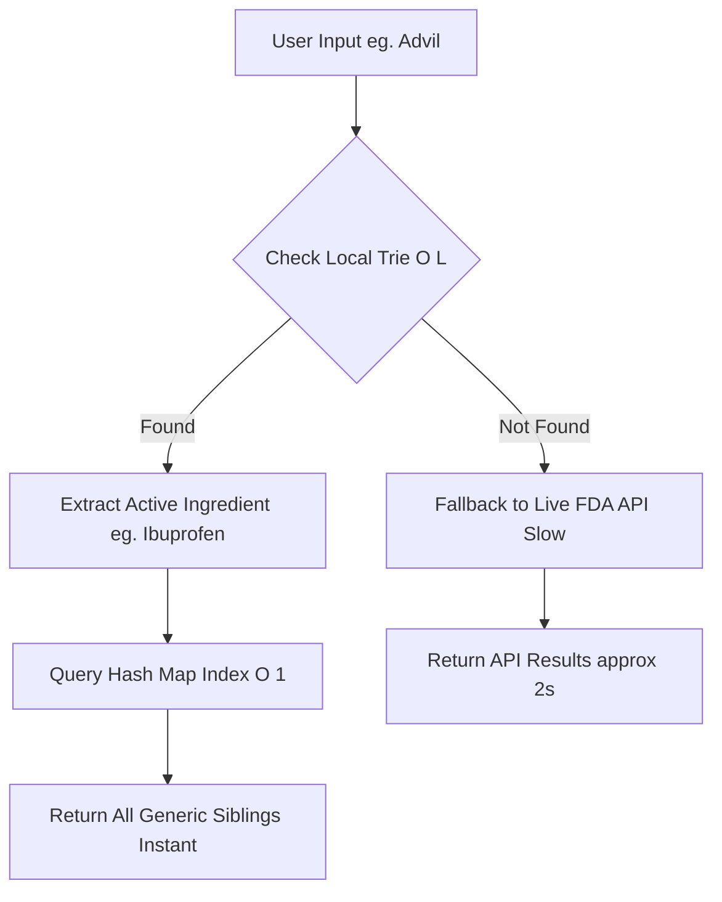

# Generic Medicine Search Engine (Hybrid Architecture)

A low-latency, high-availability search engine designed to find affordable generic alternatives for brand-name medicines.

This project has evolved from a simple API wrapper into a **hybrid system**. It prioritizes sub-millisecond local lookups using custom in-memory data structures and gracefully falls back to the live openFDA API only when necessary.

---

### 🚀 Key Technical Features

* **Hybrid Architecture (Offline-First):** Implements a "Cache-Aside" strategy. The system consults a local, in-memory hot cache first for instant results and uses the live openFDA API as a comprehensive fallback source.
* **Optimized Latency (O(L) Search):** Utilizes a custom-built **Trie (Prefix Tree)** data structure to perform searches in $O(L)$ time (where $L$ is the length of the search query), regardless of the dataset size.
* **Relational Data Mapping (O(1) Lookup):** Once a medicine is identified via the Trie, an accompanying **Hash Map (Dictionary)** is used to instantly retrieve all related generic alternatives grouped by active ingredient in $O(1)$ time.
* **Fault Tolerance:** The system is designed to fail gracefully. If the local cache fails to initialize, the application automatically degrades to a purely online mode, ensuring 100% uptime for the user.
* **Custom Data Pipeline:** Includes the original ETL (Extract, Transform, Load) scripts used to scrape, sanitize, and structure the local dataset from raw sources.

---

### 🛠️ System Architecture

The search logic follows a three-tiered approach to ensure the fastest possible response time:

1. Tier 1: In-Memory Trie: The app loads a processed JSON dataset into RAM on startup. User queries are first checked against this Trie for immediate prefix matching.

2. Tier 2: In-Memory Hash Map: If a match is found in the Trie, its active ingredient is used as a key to instantly fetch the complete list of alternative medicines from a pre-grouped Hash Map.

3. Tier 3: Live API Fallback: If the medicine is not found locally (a cache miss), the system makes a real-time network request to the openFDA API to retrieve the data.

### 📂 Project Structure

The codebase is organized to separate application logic from data engineering tasks.

* **`app.py`**: The core Flask application. It handles server startup, loads data into RAM, and implements the hybrid search routing logic.
* **`trie.py`**: Contains the custom Python implementation of the `TrieNode` and `MedicineTrie` classes used for $O(L)$ prefix searching.
* **`medicines_data.json`**: The processed, structured dataset that acts as the local hot cache.
* **`data_pipeline/`**: A directory containing the raw ETL scripts used to engineer the dataset:
    * `discover_brands.py`: Scripts for initial data gathering.
    * `convert_to_json.py`: Cleans and structures raw data into the final JSON format.
* **`templates/`**: Holds the frontend HTML interface.

---

### 🔮 Future Roadmap

While the current system achieves significant latency improvements, future scalability plans include:

* **Automated Cache Invalidation:** Implementing a daily Cron Job (using Celery or a similar task queue) to query the FDA API for delta updates and refresh the local `medicines_data.json` cache automatically.
* **Persistent In-Memory Store:** Migrating from a Python dictionary to a dedicated Redis instance to handle much larger datasets beyond single-server RAM limits.
* **Fuzzy Search:** Integrating Levenshtein distance algorithms into the Trie traversal to handle user typos gracefully.
