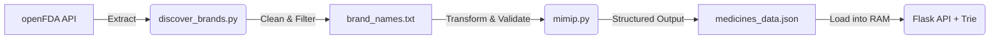
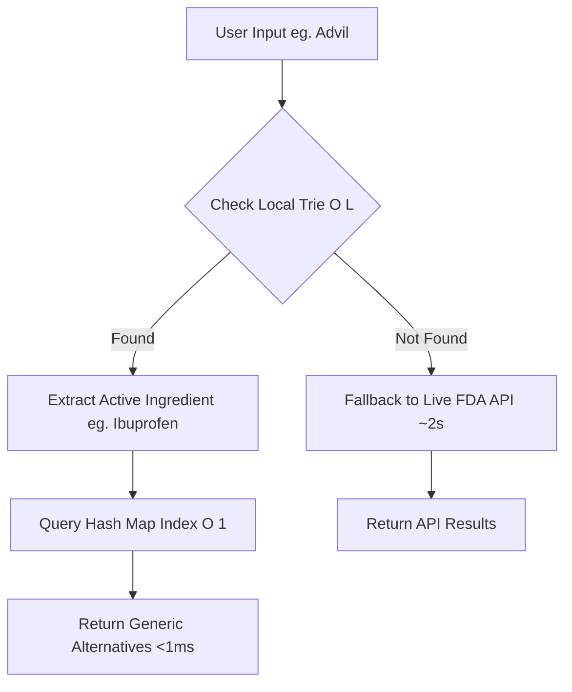

# Generic Medicine Data Platform (ETL + Low-Latency API)

A hybrid data platform designed to find affordable generic alternatives for brand-name medicines.  
This system combines a **custom ETL data pipeline** with a **low-latency, fault-tolerant search API**, enabling sub-millisecond local lookups with intelligent fallback to live data sources.

---

## 🚀 Key Technical Features

* **Hybrid Architecture (Offline-First):** Implements a cache-aside strategy—serving results from an in-memory dataset first and falling back to the live openFDA API only on cache misses.
* **Optimized Latency ($O(L)$ Search):** Uses a custom-built **Trie (Prefix Tree)** for prefix-based search in $O(L)$ time, independent of dataset size.
* **Relational Mapping ($O(1)$ Lookup):** Uses a **Hash Map (Dictionary)** to instantly retrieve all generic alternatives grouped by active ingredient in $O(1)$ time.
* **Fault Tolerance:** Automatically degrades to live API mode if the local cache fails, ensuring high availability.
* **End-to-End Data Pipeline:** Includes a full ETL workflow to extract, clean, validate, and structure real-world medical data.

---

## 📊 Data Engineering Pipeline (ETL)

A custom Python-based ETL pipeline was developed to transform raw, inconsistent API data into a structured, query-optimized dataset.

* **Extract:** Pulled raw drug data from the openFDA API with batching and rate-limit handling.
* **Transform:**
  - Normalized inconsistent drug names and formats.
  - Removed duplicates and packaging noise.
  - Enforced strict **active ingredient matching** using set-based validation.
* **Load:** Structured cleaned data into a nested JSON format optimized for in-memory access.
* **Data Validation:** Implemented checks for dataset completeness, consistency, and correctness before deployment.



---

## ⚙️ System Architecture & Execution Flow



### 🔍 Execution Flow
* **Tier 1: In-Memory Trie:** Performs prefix matching on user input in $O(L)$ time. Enables instant type-ahead search.
* **Tier 2: In-Memory Hash Map:** Uses active ingredient as a key. Retrieves all related medicines in $O(1)$ time.
* **Tier 3: Live API Fallback:** Handles cache misses via real-time openFDA API calls. Ensures completeness and reliability. 

---

## 📂 Project Structure

```text
├── app.py                  # Flask application (API + routing logic)
├── trie.py                 # Trie implementation for O(L) search
├── medicines_data.json     # Preprocessed dataset (hot cache)
├── data_pipeline/
│   ├── discover_brands.py  # Raw data extraction
│   ├── mimip.py            # Transformation + validation logic
│   └── json_check.py       # Data quality checks
└── templates/              # Frontend interface
```

---

## 💻 Local Setup

```bash
# Clone the repository
git clone https://github.com/ayushk-codes/Generic-Medicine-Recommendation.git

# Move into the project directory
cd Generic-Medicine-Recommendation

# Install dependencies
pip install -r requirements.txt

# Add your FDA API key
echo "FDA_API_KEY=your_api_key_here" > .env

# Run the server
python app.py
```

---

## 🔮 Future Roadmap

* **Automated Cache Invalidation:** Scheduled ETL jobs (Cron / Celery) to refresh dataset with incremental updates.
* **Pipeline Orchestration:** Integrate tools like Apache Airflow for managing ETL workflows.
* **Scalable Storage:** Migrate in-memory dictionary to Redis for larger datasets.
* **Fuzzy Search:** Add Levenshtein distance support for typo-tolerant queries.
* **Data Expansion:** Incorporate additional sources for broader drug coverage.

---

## 🧠 Key Takeaway
This project demonstrates the ability to:
1. Build real-world ETL pipelines for messy, external data.
2. Design low-latency backend systems with optimized data structures.
3. Balance data engineering and system design in a production-style architecture.